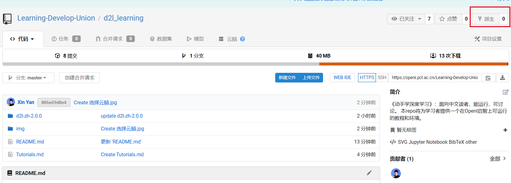
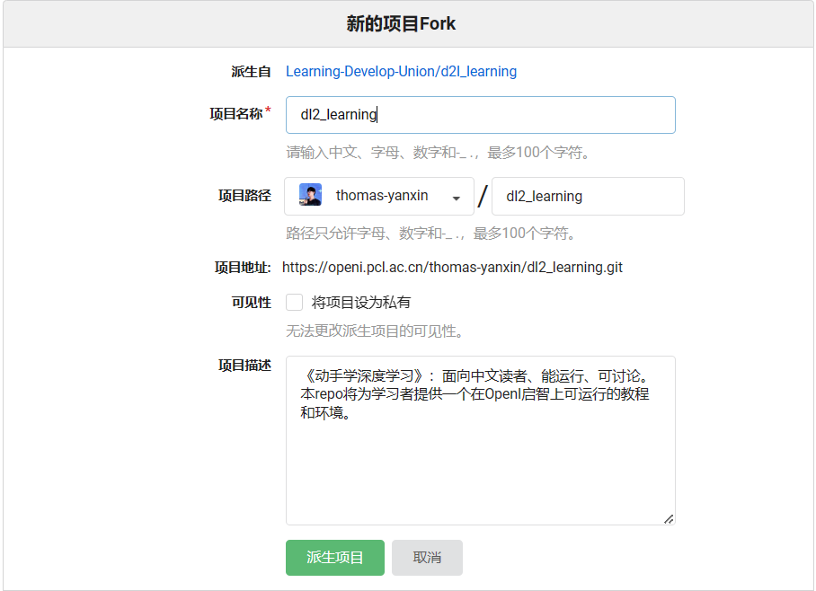
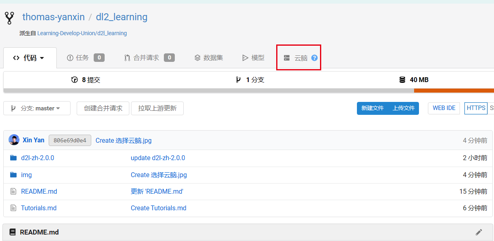
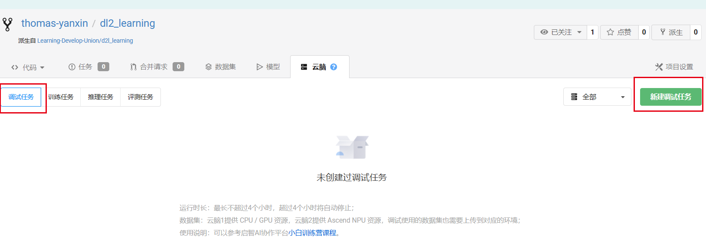
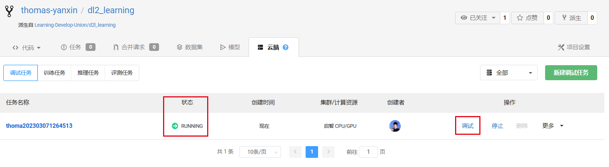
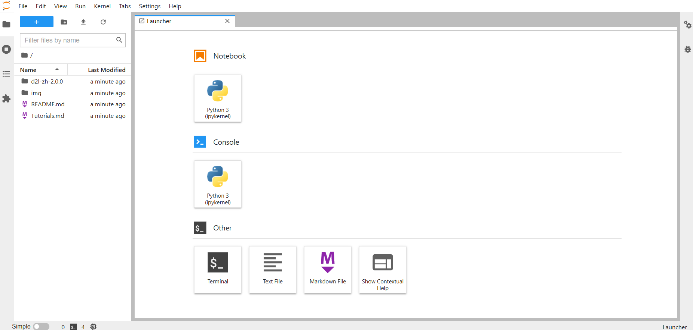

# D2L&OpenI使用教程
1. 派生[d2l_learning](https://openi.pcl.ac.cn/Learning-Develop-Union/d2l_learning)项目至自己名下
  
2. 新项目Fork，填写相关信息

3. 点击选择云脑

4. 新建调试任务

5. 选择集群(这里以启智集群为例)
启智集群和智算集群的区别, 详情请参考[资源说明](https://openi.pcl.ac.cn/resource_desc). 相对而言, 在调试环境中, 使用智算集群的V100资源, 资源调度会更快一些.
.jpg)
6. 粘贴镜像，选择资源规格  
在学习和实践《动手学深度学习(PyTorch版)》的过程中, 我们更推荐您使用此镜像: `dockerhub.pcl.ac.cn:5000/user-images/openi:d2l-learning` . 此镜像已经包含了本项目中需要的绝大多数Python库, 使用此镜像, 您可以免去安装环境的困扰!.jpg)
资源规格需要根据自己的实际使用情况和积分积累情况进行合适的选择.
7. 等待，待状态为Running时进入调试

等待时长适算力资源的使用人数而定, 请耐心等待.
8. 进入调试后即可看到初始的Notebook界面

然后即可在OpenI-AI协作平台的在线环境中进行自己的代码工作.
